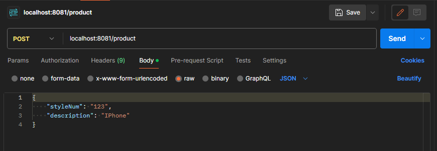
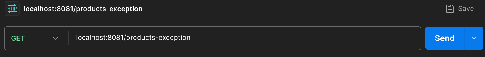
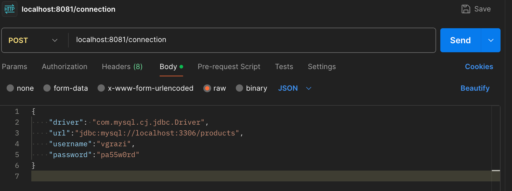

# Chapter 11: Coding the Aspect-Oriented Way

This repository contains the code from the book for Chapter 11, Coding the Aspect-Oriented Way. See the [main book page](https://github.com/realworldjava) for the list of all chapter specific repositories.

# How this repository is organized

In this repository, all code is in the main branch. There are two folders: 
| Folder Name  | Contents |
| ------------- | ------------- |
|pre-aop| How code would be written if AOP did not exist|
|aop| The majority of the chapter code|

# How to run the examples in this chapter

If you want to use an IDE, import the directory you want as a Maven project so you have the proper dependencies.

If you want to use the command line, cd to the directory for that example and run 
```
1. mvn verify
1. mvn spring-boot:run
```

You can choose to use either Postman or curl for the examples in this chapter. See the chapter 6 readme for where to get them.

## Postman

To use for the initial logging aspect example:
1. For the first example, configure the Postman call as follows using the following settings:



Settings:
1. Change GET to POST in the pulldown
1. Enter the endpoint: localhost:8081/product
1. On the body tab, make sure to click "Raw" and specify JSON in the dropdown, as shown.
1. In the call body text area, there should be the following Json string:

<pre>
{
    "styleNum" : 123,
    "description" : "IPhone"
}
</pre>

For the second example, choose GET from the pulldown and the URL localhost:8081/products-exception as shown in 



For the third example, go back to the POST settings with the URL localhost:8081/connection and the body

<pre>
{
    "driver": "com.mysql.cj.jdbc.Driver",
    "url":"jdbc:mysql://localhost:3306/products",
    "username":"vgrazi",
    "password":"pa55w0rd"
}
</pre>



## Curl

The curl command for this example is:

<pre>
curl  -H "Accept: application/json" \
      -H "Content-Type: application/json" \
      -X POST localhost:8081/product \
      -d '{ "styleNum" : 123, "description" : "IPhone"}'
</pre>

The headers (-H) correspond to the JSON pull down in the Postman example.  The -d corresponds to the textbox.

For the second example, the command is

<pre>
curl localhost:8081/products-exception
</pre>

For the third example, the command is

<pre>
curl  -H "Accept: application/json" \
      -H "Content-Type: application/json" \
      -X POST localhost:8081/connection \
      -d '{ "driver": "com.mysql.cj.jdbc.Driver", "url":"jdbc:mysql://localhost:3306/products",  "username":"vgrazi",  "password":"pa55w0rd" }'
</pre>

# Clickable Links from the Further References Section

* [Complete documentation for Spring AOP](https://docs.spring.io/spring-framework/reference/core/aop.html)
* [Documentation for AspectJ, a broader aspects framework that works for even non-Spring proj](https://eclipse.dev/aspectj)
